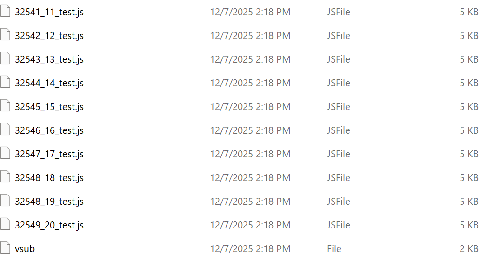

# Batch Job Generator

A general-purpose batch job generator designed for HPC environments. 

User provides:
- a master job template (.js, .mjs)
- any input list/matrix filepath required for job specifications
- a config file with all the above information documented

The scripts runs on the system input of config filename. 

The config should be formatted as `key=values` pairs per row. 

A `key` maybe named arbitrarily at user's discretion, but it must match with the placeholder name used in the master job template. 

A `value` accepts three types of input: a filepath, a filepath with a column index specified, a Python-style patterns with `{key}`. 

In general, the config defines the input/output filepaths, job directories, and job settings, but they can be structured in any manner and in any numbers of keys at user's convenience. 

The script will resolve all the placeholders, expands the rows of the config input, generate the jobs according to the input data length, and specify the job setting and job dependence in a separate submission file, ready to be submitted the HPC system. 

In short:

`Config in->Master template, Lists/Matrices->Batch jobs out`

No workflow assumptions. No fixed naming rules. Flexible for generic job generation in any HPC system. 

## Key features
- **Format: `key=values` per line.**
  - Invalid lines, empty lines, and comment lines (`#...`) will be skipped.
- **Quotes and whitespace around keys/values are automatically stripped.**
- **Automatic classification of values:**
  - Strings containing `{...}` -> patterns
  - Filepath::idx -> matrix column input. Column index starts at 1. 
  - Filepath/constant string
- **All filepaths will be checked for existence**:
  - If not existent, the value is downgraded to a constant string value and a warning message is issued.
  - in the case of matrix input, both the filepath and the column index will be checked for existence. Proper error messages would be issued if needed.
- **Pattern-type values: pure number keys are accepted (unlike the python rule), and normal python formatting syntax is accepted.**
  - The common syntax associated with HPC submission commands are encoded to recognized this type of input. For this type of patterns, multiple keys can be entered into the `{...}` with any delimiter.
- **Dependency-aware pattern expansion:**
  - Pattern-type values format a graph that is automatically topologically sorted.
  - Cycles will be detected and reported.
  - Any order of input in the config file is supported because of this feature.
- **Master job template validation:**
  - If a master job is not detected, the system will prompt the user to enter one, which will be checked for existence.
- **Jobname key validation:**
  - If there is submission command key, the jobname key would be missing. In this case, the system searches for keys that somewhat resemble the string `jobname`. 
  - If the system find 0 or more than 1 such keys, user will be prompted to enter or select the keyname and/or the value in patterns/paths. Proper checks will be done to the input.
- **Job generation:**
  - Job paths will be extracted from jobname input and applied to the submission command file.
    
## Config example
```
id = list_id
cnt = template.js
outdat = /10_test/user_A/{id}_{111333}_test
jobname = ./test1/{id}_{111333}_test
indat2 = {indat1}_{const1}_{111333}
indat1 = list_id::2
const1 = example_test
111333 = col_file
cmd = {jobname} uds: sysconfig -zsth -r99 -d{indat1,indat2}
```
### Output example


## Project structure 
```
├── src/
|   ├── job_generator_v1.py
├── Examples/
    ├── config.conf
    ├── sample_output_dir_screenshot.png
├── README.md
├── LICENSE
```

## Development
This project currently contains a single core script:
```
src/job_generator_v1.py
```
- Python 3.7+  
- No external dependencies (only standard library)
- All logic — config parsing, classification, placeholder resolution,
  job expansion, and submission file generation — is unified in one script.
### Roadmap
Planned enhancements include:
- YAML / JSON config support
- Dry-run mode and detailed logging
- Auto-submission support for SLURM / PBS / LSF
- Compatibility checks for mismatched placeholder usage
- Plugin interface for custom job systems

Contributions are welcome.
